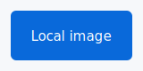

= Kroki Embedded Preview Fixture
:kroki-default-format: svg

== Mermaid

[mermaid]
----
flowchart TD
  A[AsciiDoc] --> B[asciidoctor-kroki-embedded]
  B --> C[VS Code Webview]
----

== PlantUML

[plantuml]
....
Alice -> Bob: Local PlantUML
Bob --> Alice: SVG
....

== Nomnoml

[nomnoml]
----
[AsciiDoc] -> [Embedded Kroki]
[Embedded Kroki] -> [Local Renderer]
----

== Vega

[vega]
----
{
  "$schema": "https://vega.github.io/schema/vega/v6.json",
  "width": 320,
  "height": 120,
  "data": [
    {
      "name": "table",
      "values": [
        { "category": "A", "amount": 28 },
        { "category": "B", "amount": 55 },
        { "category": "C", "amount": 43 }
      ]
    }
  ],
  "scales": [
    {
      "name": "xscale",
      "type": "band",
      "domain": { "data": "table", "field": "category" },
      "range": "width",
      "padding": 0.1
    },
    {
      "name": "yscale",
      "domain": { "data": "table", "field": "amount" },
      "nice": true,
      "range": "height"
    }
  ],
  "axes": [
    { "orient": "bottom", "scale": "xscale" },
    { "orient": "left", "scale": "yscale" }
  ],
  "marks": [
    {
      "type": "rect",
      "from": { "data": "table" },
      "encode": {
        "enter": {
          "x": { "scale": "xscale", "field": "category" },
          "width": { "scale": "xscale", "band": 1 },
          "y": { "scale": "yscale", "field": "amount" },
          "y2": { "scale": "yscale", "value": 0 },
          "fill": { "value": "#4078c0" }
        }
      }
    }
  ]
}
----

== Vega-Lite

[vegalite]
----
{
  "$schema": "https://vega.github.io/schema/vega-lite/v6.json",
  "width": 320,
  "height": 120,
  "data": {
    "values": [
      { "category": "A", "amount": 12 },
      { "category": "B", "amount": 38 },
      { "category": "C", "amount": 24 }
    ]
  },
  "mark": "bar",
  "encoding": {
    "x": { "field": "category", "type": "nominal" },
    "y": { "field": "amount", "type": "quantitative" }
  }
}
----

== WaveDrom

[wavedrom]
----
{
  signal: [
    { name: "clk", wave: "p....." },
    { name: "data", wave: "x.345x", data: ["head", "body", "tail"] },
    { name: "req", wave: "0.1..0" }
  ]
}
----

== Bytefield

[bytefield]
----
{
  reg: [
    { bits: 8, name: "opcode" },
    { bits: 16, name: "payload" },
    { bits: 8, name: "flags" }
  ]
}
----

== Local Diagram Macros

mermaid::diagrams/macro.mmd[]

plantuml::diagrams/sequence.puml[]

nomnoml::diagrams/model.nomnoml[]

vega::diagrams/chart.vega[]

vegalite::diagrams/chart.vegalite[]

wavedrom::diagrams/timing.wavedrom[]

bytefield::diagrams/register.bytefield[]

== Local Image Boundary

== Remote Image Boundary

image::https://example.com/should-not-load.png[Remote image should be blocked]
